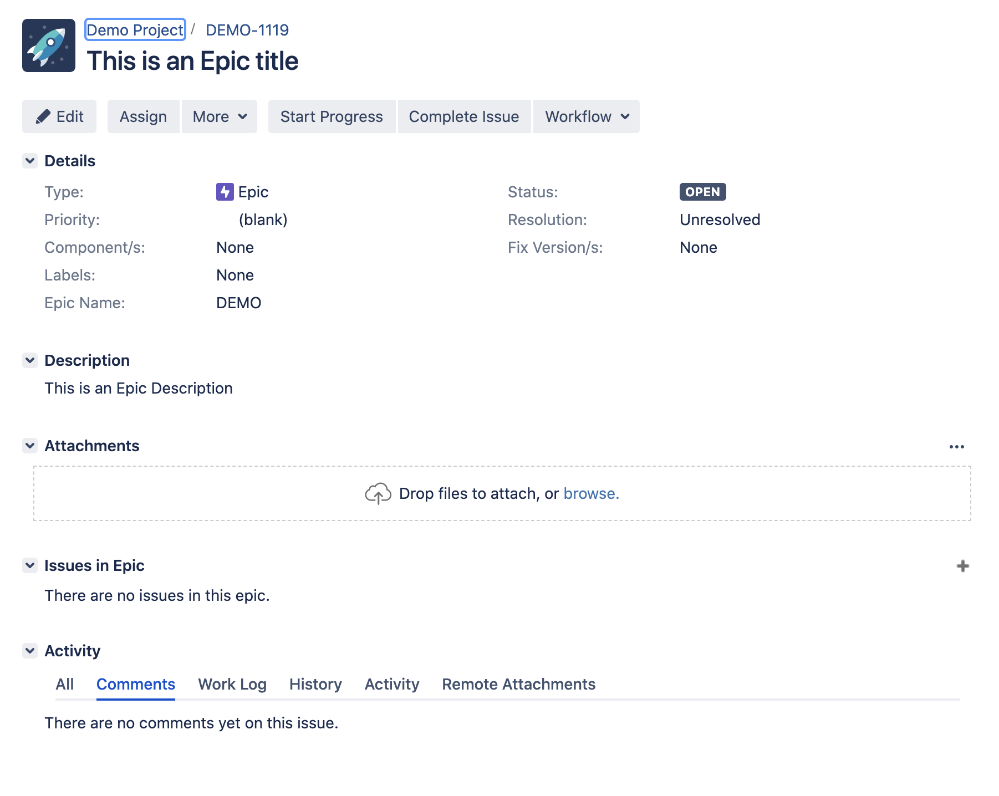
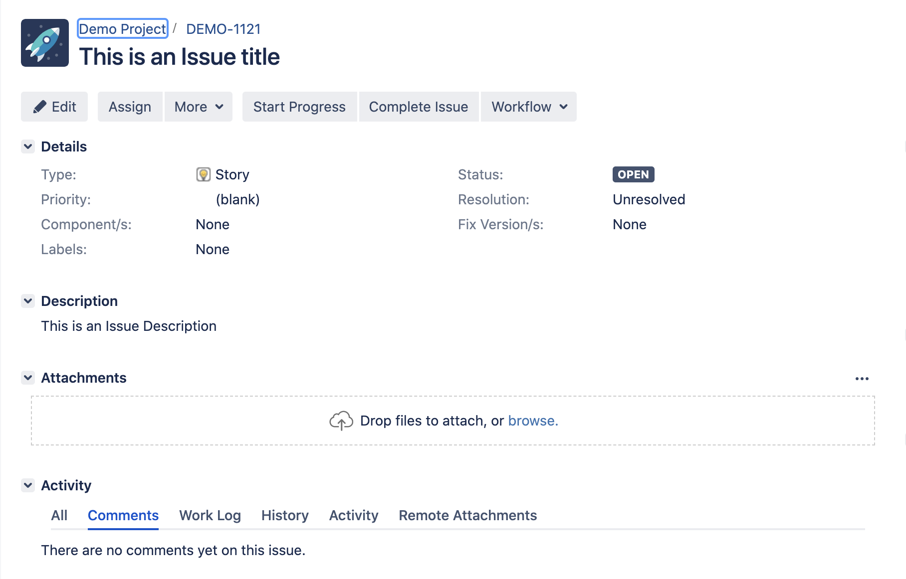

# GO JIRA integration example
This example is based on github.com/andygrunwald/go-jira work.

The example has options to fetch the projects, create an epic or create a story.

# To generate an executable
Mac Executable:
env GOOS=darwin GOARCH=amd64 go build -o jiraintegration  cmd/jiraintegration/main.go

Linux Executable:
env GOOS=linux GOARCH=amd64 go build -o jiraintegration  cmd/jiraintegration/main.go

Windows Executable
env GOOS=darwin GOARCH=amd64 go build -o jiraintegration  cmd/jiraintegration/main.go

# To run the program
./jiraintegration -j=https://jira-url/ -t=fetch

# Property files
jiraproperties.json -> contains the consumer key and private key

epic.json -> contains information about what the epic needs to be created with.

issue.json -> contains information about what the story needs to be created with.

# JIRA Secrets
To talk to JIRA using OAuth you would need Consumer key and Private key via Jira Administration -> Applications -> Application links

Consumer key is bascially a unique identifier for your application.

More instructions here: 
https://community.atlassian.com/t5/Jira-questions/How-to-get-consumer-key-for-jira-Oauth1/qaq-p/49925

# Custom field examples
https://developer.atlassian.com/server/jira/platform/jira-rest-api-examples/

# Epic example

# Story example
